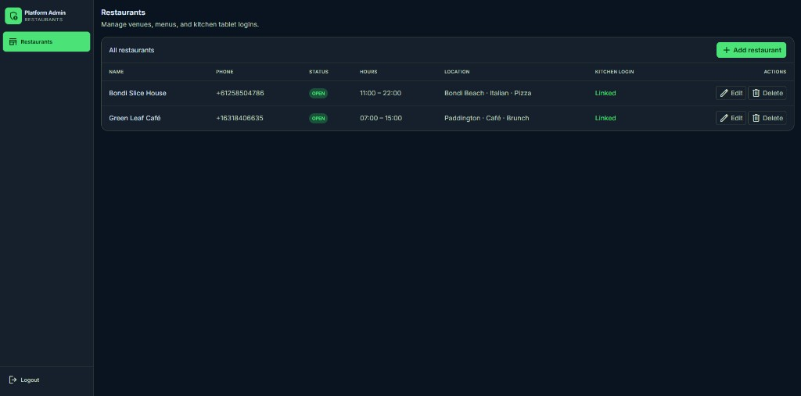
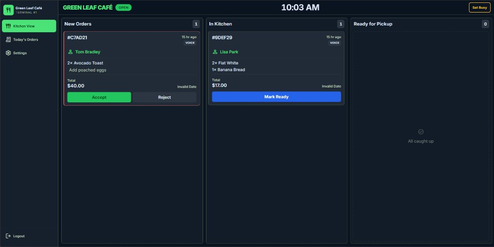
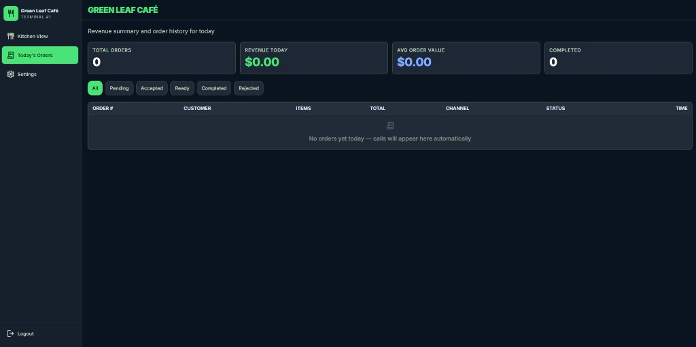
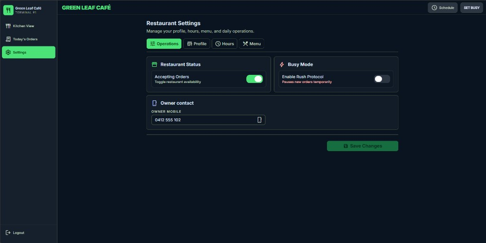

# Kitchen Command AI — Portfolio Overview

**End-to-end AI phone ordering platform** for restaurants: Retell AI voice agents take orders over the phone, a Railway API orchestrates sessions, carts, and confirmations, and a Next.js kitchen tablet dashboard fulfills orders in real time—with multi-restaurant admin onboarding.

> **Public portfolio repo** — production prompts, Retell agent configs, and credentials remain in **private** repositories.

## Live demo

| | Link |
|---|------|
| **Kitchen & admin app** | **https://ai-kitchen-ai.vercel.app** |
| **Voice ordering (Retell)** | Call **+61 2 5850 4786** — Maya takes your order and sends it to the kitchen board |

## Screenshots

| Platform admin — multi-restaurant |
|:---:|
|  |

| Kitchen kanban — voice orders (`VOICE` channel) |
|:---:|
|  |

| Today's orders — revenue & history |
|:---:|
|  |

| Restaurant settings — hours, menu, busy mode |
|:---:|
|  |

## Problem

Restaurants lose revenue when staff cannot answer the phone during service peaks. Generic IVR cannot take complex food orders. Kitchen teams need a **single live view** of voice orders without manual re-entry.

## Solution

An **omnichannel ordering stack** (voice + kitchen UI) inspired by enterprise CRM patterns: capture intent on the call, persist structured orders, and surface them instantly to the kitchen—similar to how retailers integrate touchpoints for a consistent customer journey.

| Channel | Role |
|---------|------|
| **Voice (Retell AI)** | Maya agent greets callers, loads menu, builds cart, confirms pickup |
| **Voice API (Railway)** | Tool endpoints, inbound webhook preload, session registry, Twilio escalate |
| **Kitchen tablet (Next.js)** | Kanban board, live Supabase realtime, accept/reject/ready |
| **Admin console** | Add restaurants, menus, and kitchen logins (role-based Supabase RLS) |

## Role

Solo founder · AI Engineer — voice agent design, full-stack API, kitchen PWA, Supabase schema/RLS, Railway deploy.

## Stack

| Layer | Technologies |
|--------|----------------|
| Voice AI | Retell AI (custom tools, inbound webhook, `call_started`) |
| Voice API | Node.js, Express, TypeScript, Railway |
| Kitchen UI | Next.js 14, Tailwind, Supabase Auth, Realtime |
| Data | Supabase (Postgres, RLS, `orders`, `menu_items`, `call_sessions`) |
| Telephony | Twilio (inbound via Retell, owner transfer on escalate) |

## Highlights

- **Sub-10s call start** — inbound webhook pre-warms menu/cache during ring; `call_started` prepares session before agent tools
- **12 custom tool routes** — session, menu, cart, confirm order, escalate; server-side `call_id` resolution (no Retell placeholder bugs)
- **Production hardening** — cart clear vs FK-safe sessions, `GET /health`, closed-restaurant guards, pickup time normalization
- **Multi-restaurant** — `twilio_number` routing, admin wizard (profile + menu + kitchen login), kitchen terminal 1:1 auth

## Architecture

See [docs/architecture.md](docs/architecture.md).

## Private production repos

| Component | GitHub (private) |
|-----------|------------------|
| Voice ordering API | [Restaurant-receptionist](https://github.com/hk204844-ui/Restaurant-receptionist) |
| Kitchen + admin UI | Local / private Next.js repo |

## Environment templates

- Voice API: see `.env.example` in this repo (placeholders only)

## Author

**Habib Khan** · [LinkedIn](https://www.linkedin.com/in/habib-khan-chan/) · [Portfolio](https://github.com/hk204844-ui/my-portfolio)
